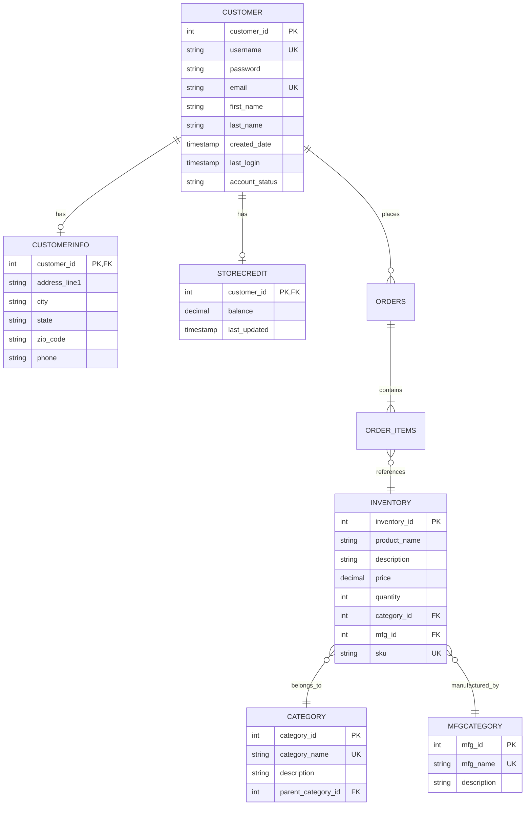
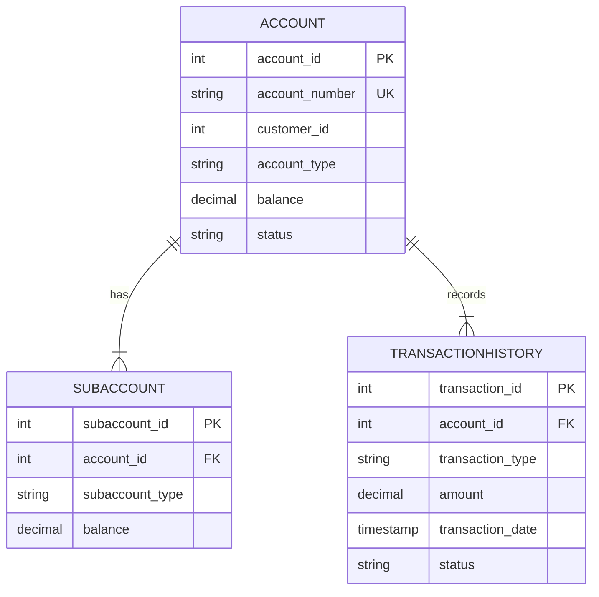
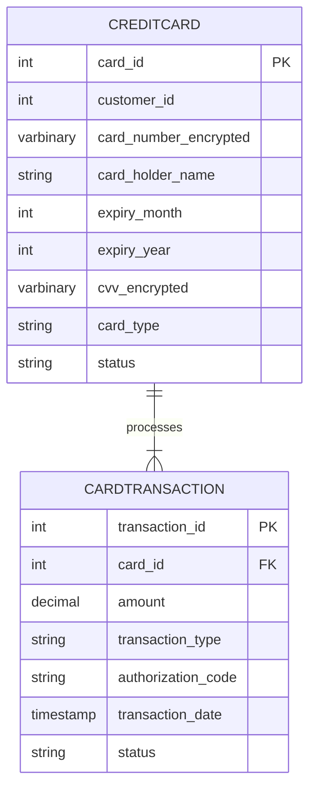
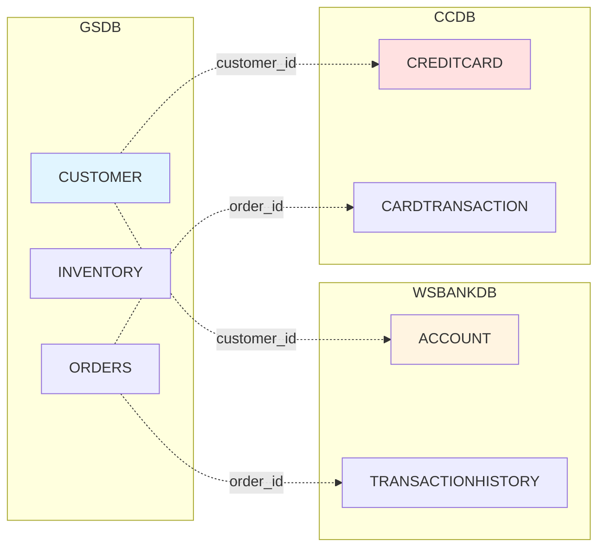

# Database Schema Documentation

## Table of Contents

1. [Overview](#overview)
2. [Database Architecture](#database-architecture)
3. [GSDB - GarageSale Database](#gsdb---garagesale-database)
4. [WSBANKDB - Banking Database](#wsbankdb---banking-database)
5. [CCDB - Credit Card Database](#ccdb---credit-card-database)
6. [Entity Relationships](#entity-relationships)
7. [Indexes and Constraints](#indexes-and-constraints)
8. [Data Types and Sizes](#data-types-and-sizes)

## Overview

The GarageSale application uses a **three-database architecture** to separate concerns and enhance security. Each database serves a specific domain and is accessed through its own JPA persistence unit.

### Database Summary

| Database | Purpose | Tables | Size (Est.) | Backup Frequency |
|----------|---------|--------|-------------|------------------|
| **GSDB** | E-commerce data | 8 | 10-50 GB | Daily |
| **WSBANKDB** | Banking transactions | 3 | 5-20 GB | Hourly |
| **CCDB** | Payment cards | 2 | 1-5 GB | Hourly |

## Database Architecture

```
┌─────────────────────────────────────────────────────────────┐
│                    Application Layer                        │
│  ┌──────────────┐  ┌──────────────┐  ┌──────────────┐     │
│  │ GarageSaleEJB│  │  WSBankEJB   │  │ CreditCardEJB│     │
│  └──────────────┘  └──────────────┘  └──────────────┘     │
└─────────────────────────────────────────────────────────────┘
                          │
        ┌─────────────────┼─────────────────┐
        ▼                 ▼                 ▼
┌──────────────┐  ┌──────────────┐  ┌──────────────┐
│ GarageSaleDB │  │  WSBankDB    │  │ CreditCardDB │
│     JPA      │  │     JPA      │  │     JPA      │
└──────────────┘  └──────────────┘  └──────────────┘
        │                 │                 │
        ▼                 ▼                 ▼
┌──────────────┐  ┌──────────────┐  ┌──────────────┐
│     GSDB     │  │  WSBANKDB    │  │     CCDB     │
│   (DB2)      │  │   (DB2)      │  │   (DB2)      │
└──────────────┘  └──────────────┘  └──────────────┘
```

## GSDB - GarageSale Database

### Purpose
Main e-commerce database containing products, customers, orders, and store operations data.

### Tables

#### 1. CUSTOMER

Stores customer account information.

```sql
CREATE TABLE CUSTOMER (
    CUSTOMER_ID INTEGER NOT NULL PRIMARY KEY GENERATED ALWAYS AS IDENTITY,
    USERNAME VARCHAR(50) NOT NULL UNIQUE,
    PASSWORD VARCHAR(255) NOT NULL,
    EMAIL VARCHAR(100) NOT NULL UNIQUE,
    FIRST_NAME VARCHAR(50) NOT NULL,
    LAST_NAME VARCHAR(50) NOT NULL,
    CREATED_DATE TIMESTAMP DEFAULT CURRENT_TIMESTAMP,
    LAST_LOGIN TIMESTAMP,
    ACCOUNT_STATUS VARCHAR(20) DEFAULT 'ACTIVE',
    CONSTRAINT CHK_ACCOUNT_STATUS CHECK (ACCOUNT_STATUS IN ('ACTIVE', 'INACTIVE', 'SUSPENDED'))
);

CREATE INDEX IDX_CUSTOMER_USERNAME ON CUSTOMER(USERNAME);
CREATE INDEX IDX_CUSTOMER_EMAIL ON CUSTOMER(EMAIL);
```

**Fields**:
- `CUSTOMER_ID` - Primary key, auto-generated
- `USERNAME` - Unique login identifier
- `PASSWORD` - Hashed password (BCrypt/SHA-256)
- `EMAIL` - Customer email address
- `FIRST_NAME` - Customer first name
- `LAST_NAME` - Customer last name
- `CREATED_DATE` - Account creation timestamp
- `LAST_LOGIN` - Last login timestamp
- `ACCOUNT_STATUS` - Account status (ACTIVE/INACTIVE/SUSPENDED)

**Relationships**:
- One-to-One with CUSTOMERINFO
- One-to-One with STORECREDIT
- One-to-Many with ORDERS (not shown in current schema)

#### 2. CUSTOMERINFO

Extended customer information including shipping addresses.

```sql
CREATE TABLE CUSTOMERINFO (
    CUSTOMER_ID INTEGER NOT NULL PRIMARY KEY,
    ADDRESS_LINE1 VARCHAR(100),
    ADDRESS_LINE2 VARCHAR(100),
    CITY VARCHAR(50),
    STATE VARCHAR(2),
    ZIP_CODE VARCHAR(10),
    COUNTRY VARCHAR(50) DEFAULT 'USA',
    PHONE VARCHAR(20),
    MOBILE VARCHAR(20),
    SHIPPING_ADDRESS_LINE1 VARCHAR(100),
    SHIPPING_ADDRESS_LINE2 VARCHAR(100),
    SHIPPING_CITY VARCHAR(50),
    SHIPPING_STATE VARCHAR(2),
    SHIPPING_ZIP_CODE VARCHAR(10),
    SHIPPING_COUNTRY VARCHAR(50) DEFAULT 'USA',
    CONSTRAINT FK_CUSTOMERINFO_CUSTOMER FOREIGN KEY (CUSTOMER_ID) 
        REFERENCES CUSTOMER(CUSTOMER_ID) ON DELETE CASCADE
);

CREATE INDEX IDX_CUSTOMERINFO_ZIP ON CUSTOMERINFO(ZIP_CODE);
CREATE INDEX IDX_CUSTOMERINFO_STATE ON CUSTOMERINFO(STATE);
```

**Fields**:
- `CUSTOMER_ID` - Foreign key to CUSTOMER
- `ADDRESS_LINE1/2` - Billing address
- `CITY`, `STATE`, `ZIP_CODE`, `COUNTRY` - Billing location
- `PHONE`, `MOBILE` - Contact numbers
- `SHIPPING_*` - Shipping address (can differ from billing)

#### 3. INVENTORY

Product catalog and stock information.

```sql
CREATE TABLE INVENTORY (
    INVENTORY_ID INTEGER NOT NULL PRIMARY KEY GENERATED ALWAYS AS IDENTITY,
    PRODUCT_NAME VARCHAR(100) NOT NULL,
    DESCRIPTION VARCHAR(500),
    PRICE DECIMAL(10,2) NOT NULL,
    QUANTITY INTEGER NOT NULL DEFAULT 0,
    CATEGORY_ID INTEGER,
    MFG_ID INTEGER,
    SKU VARCHAR(50) UNIQUE,
    IMAGE_URL VARCHAR(255),
    WEIGHT DECIMAL(8,2),
    DIMENSIONS VARCHAR(50),
    CREATED_DATE TIMESTAMP DEFAULT CURRENT_TIMESTAMP,
    LAST_UPDATED TIMESTAMP DEFAULT CURRENT_TIMESTAMP,
    STATUS VARCHAR(20) DEFAULT 'ACTIVE',
    CONSTRAINT FK_INVENTORY_CATEGORY FOREIGN KEY (CATEGORY_ID) 
        REFERENCES CATEGORY(CATEGORY_ID),
    CONSTRAINT FK_INVENTORY_MFG FOREIGN KEY (MFG_ID) 
        REFERENCES MFGCATEGORY(MFG_ID),
    CONSTRAINT CHK_PRICE CHECK (PRICE >= 0),
    CONSTRAINT CHK_QUANTITY CHECK (QUANTITY >= 0),
    CONSTRAINT CHK_STATUS CHECK (STATUS IN ('ACTIVE', 'DISCONTINUED', 'OUT_OF_STOCK'))
);

CREATE INDEX IDX_INVENTORY_CATEGORY ON INVENTORY(CATEGORY_ID);
CREATE INDEX IDX_INVENTORY_MFG ON INVENTORY(MFG_ID);
CREATE INDEX IDX_INVENTORY_SKU ON INVENTORY(SKU);
CREATE INDEX IDX_INVENTORY_PRICE ON INVENTORY(PRICE);
CREATE INDEX IDX_INVENTORY_STATUS ON INVENTORY(STATUS);
```

**Fields**:
- `INVENTORY_ID` - Primary key, auto-generated
- `PRODUCT_NAME` - Product name
- `DESCRIPTION` - Product description
- `PRICE` - Unit price
- `QUANTITY` - Available stock quantity
- `CATEGORY_ID` - Foreign key to CATEGORY
- `MFG_ID` - Foreign key to MFGCATEGORY
- `SKU` - Stock Keeping Unit (unique identifier)
- `IMAGE_URL` - Product image URL
- `WEIGHT` - Product weight (for shipping)
- `DIMENSIONS` - Product dimensions
- `STATUS` - Product status

#### 4. CATEGORY

Product categories for organization and filtering.

```sql
CREATE TABLE CATEGORY (
    CATEGORY_ID INTEGER NOT NULL PRIMARY KEY GENERATED ALWAYS AS IDENTITY,
    CATEGORY_NAME VARCHAR(50) NOT NULL UNIQUE,
    DESCRIPTION VARCHAR(255),
    PARENT_CATEGORY_ID INTEGER,
    DISPLAY_ORDER INTEGER DEFAULT 0,
    CONSTRAINT FK_CATEGORY_PARENT FOREIGN KEY (PARENT_CATEGORY_ID) 
        REFERENCES CATEGORY(CATEGORY_ID)
);

CREATE INDEX IDX_CATEGORY_NAME ON CATEGORY(CATEGORY_NAME);
CREATE INDEX IDX_CATEGORY_PARENT ON CATEGORY(PARENT_CATEGORY_ID);
```

**Fields**:
- `CATEGORY_ID` - Primary key, auto-generated
- `CATEGORY_NAME` - Category name (unique)
- `DESCRIPTION` - Category description
- `PARENT_CATEGORY_ID` - For hierarchical categories
- `DISPLAY_ORDER` - Sort order for display

**Example Data**:
```
Electronics
├── Computers
├── Phones
└── Tablets
Home & Garden
├── Furniture
└── Appliances
```

#### 5. MFGCATEGORY

Manufacturer/brand information.

```sql
CREATE TABLE MFGCATEGORY (
    MFG_ID INTEGER NOT NULL PRIMARY KEY GENERATED ALWAYS AS IDENTITY,
    MFG_NAME VARCHAR(50) NOT NULL UNIQUE,
    DESCRIPTION VARCHAR(255),
    COUNTRY VARCHAR(50),
    WEBSITE VARCHAR(255),
    CONTACT_EMAIL VARCHAR(100)
);

CREATE INDEX IDX_MFG_NAME ON MFGCATEGORY(MFG_NAME);
```

**Fields**:
- `MFG_ID` - Primary key, auto-generated
- `MFG_NAME` - Manufacturer name (unique)
- `DESCRIPTION` - Manufacturer description
- `COUNTRY` - Country of origin
- `WEBSITE` - Manufacturer website
- `CONTACT_EMAIL` - Contact email

#### 6. STORECREDIT

Customer store credit balances.

```sql
CREATE TABLE STORECREDIT (
    CUSTOMER_ID INTEGER NOT NULL PRIMARY KEY,
    BALANCE DECIMAL(10,2) NOT NULL DEFAULT 0.00,
    LAST_UPDATED TIMESTAMP DEFAULT CURRENT_TIMESTAMP,
    CONSTRAINT FK_STORECREDIT_CUSTOMER FOREIGN KEY (CUSTOMER_ID) 
        REFERENCES CUSTOMER(CUSTOMER_ID) ON DELETE CASCADE,
    CONSTRAINT CHK_BALANCE CHECK (BALANCE >= 0)
);

CREATE INDEX IDX_STORECREDIT_BALANCE ON STORECREDIT(BALANCE);
```

**Fields**:
- `CUSTOMER_ID` - Foreign key to CUSTOMER
- `BALANCE` - Available store credit
- `LAST_UPDATED` - Last modification timestamp

#### 7. SETTINGS

Application configuration settings.

```sql
CREATE TABLE SETTINGS (
    SETTING_ID INTEGER NOT NULL PRIMARY KEY GENERATED ALWAYS AS IDENTITY,
    SETTING_KEY VARCHAR(100) NOT NULL UNIQUE,
    SETTING_VALUE VARCHAR(500),
    DESCRIPTION VARCHAR(255),
    LAST_UPDATED TIMESTAMP DEFAULT CURRENT_TIMESTAMP
);

CREATE INDEX IDX_SETTINGS_KEY ON SETTINGS(SETTING_KEY);
```

**Fields**:
- `SETTING_ID` - Primary key, auto-generated
- `SETTING_KEY` - Configuration key (unique)
- `SETTING_VALUE` - Configuration value
- `DESCRIPTION` - Setting description

**Example Settings**:
```
TAX_RATE = 0.08
SHIPPING_BASE_RATE = 5.99
FREE_SHIPPING_THRESHOLD = 50.00
MAX_CART_ITEMS = 100
```

#### 8. OPENJPA_SEQUENCE_TABLE

JPA sequence generator table.

```sql
CREATE TABLE OPENJPA_SEQUENCE_TABLE (
    ID SMALLINT NOT NULL PRIMARY KEY,
    SEQUENCE_VALUE BIGINT
);
```

### GSDB Entity Relationship Diagram



## WSBANKDB - Banking Database

### Purpose
Manages banking accounts and financial transactions for payment processing.

### Tables

#### 1. ACCOUNT

Bank account information.

```sql
CREATE TABLE ACCOUNT (
    ACCOUNT_ID INTEGER NOT NULL PRIMARY KEY GENERATED ALWAYS AS IDENTITY,
    ACCOUNT_NUMBER VARCHAR(20) NOT NULL UNIQUE,
    CUSTOMER_ID INTEGER NOT NULL,
    ACCOUNT_TYPE VARCHAR(20) NOT NULL,
    BALANCE DECIMAL(15,2) NOT NULL DEFAULT 0.00,
    CURRENCY VARCHAR(3) DEFAULT 'USD',
    STATUS VARCHAR(20) DEFAULT 'ACTIVE',
    CREATED_DATE TIMESTAMP DEFAULT CURRENT_TIMESTAMP,
    LAST_TRANSACTION_DATE TIMESTAMP,
    CONSTRAINT CHK_ACCOUNT_TYPE CHECK (ACCOUNT_TYPE IN ('CHECKING', 'SAVINGS', 'CREDIT')),
    CONSTRAINT CHK_ACCOUNT_STATUS CHECK (STATUS IN ('ACTIVE', 'FROZEN', 'CLOSED')),
    CONSTRAINT CHK_BALANCE CHECK (BALANCE >= -10000.00)
);

CREATE INDEX IDX_ACCOUNT_NUMBER ON ACCOUNT(ACCOUNT_NUMBER);
CREATE INDEX IDX_ACCOUNT_CUSTOMER ON ACCOUNT(CUSTOMER_ID);
CREATE INDEX IDX_ACCOUNT_STATUS ON ACCOUNT(STATUS);
```

**Fields**:
- `ACCOUNT_ID` - Primary key, auto-generated
- `ACCOUNT_NUMBER` - Unique account number
- `CUSTOMER_ID` - Reference to customer (in GSDB)
- `ACCOUNT_TYPE` - Type of account
- `BALANCE` - Current balance
- `CURRENCY` - Currency code (ISO 4217)
- `STATUS` - Account status

#### 2. SUBACCOUNT

Sub-accounts linked to main accounts.

```sql
CREATE TABLE SUBACCOUNT (
    SUBACCOUNT_ID INTEGER NOT NULL PRIMARY KEY GENERATED ALWAYS AS IDENTITY,
    ACCOUNT_ID INTEGER NOT NULL,
    SUBACCOUNT_TYPE VARCHAR(20) NOT NULL,
    BALANCE DECIMAL(15,2) NOT NULL DEFAULT 0.00,
    DESCRIPTION VARCHAR(255),
    CONSTRAINT FK_SUBACCOUNT_ACCOUNT FOREIGN KEY (ACCOUNT_ID) 
        REFERENCES ACCOUNT(ACCOUNT_ID) ON DELETE CASCADE,
    CONSTRAINT CHK_SUBACCOUNT_TYPE CHECK (SUBACCOUNT_TYPE IN ('ESCROW', 'RESERVE', 'INTEREST'))
);

CREATE INDEX IDX_SUBACCOUNT_ACCOUNT ON SUBACCOUNT(ACCOUNT_ID);
```

#### 3. TRANSACTIONHISTORY

Transaction log for all account activities.

```sql
CREATE TABLE TRANSACTIONHISTORY (
    TRANSACTION_ID INTEGER NOT NULL PRIMARY KEY GENERATED ALWAYS AS IDENTITY,
    ACCOUNT_ID INTEGER NOT NULL,
    TRANSACTION_TYPE VARCHAR(20) NOT NULL,
    AMOUNT DECIMAL(15,2) NOT NULL,
    BALANCE_BEFORE DECIMAL(15,2),
    BALANCE_AFTER DECIMAL(15,2),
    DESCRIPTION VARCHAR(255),
    REFERENCE_NUMBER VARCHAR(50),
    TRANSACTION_DATE TIMESTAMP DEFAULT CURRENT_TIMESTAMP,
    STATUS VARCHAR(20) DEFAULT 'COMPLETED',
    CONSTRAINT FK_TRANSACTION_ACCOUNT FOREIGN KEY (ACCOUNT_ID) 
        REFERENCES ACCOUNT(ACCOUNT_ID),
    CONSTRAINT CHK_TRANSACTION_TYPE CHECK (TRANSACTION_TYPE IN 
        ('DEBIT', 'CREDIT', 'TRANSFER', 'FEE', 'INTEREST', 'REFUND')),
    CONSTRAINT CHK_TRANSACTION_STATUS CHECK (STATUS IN 
        ('PENDING', 'COMPLETED', 'FAILED', 'REVERSED'))
);

CREATE INDEX IDX_TRANSACTION_ACCOUNT ON TRANSACTIONHISTORY(ACCOUNT_ID);
CREATE INDEX IDX_TRANSACTION_DATE ON TRANSACTIONHISTORY(TRANSACTION_DATE);
CREATE INDEX IDX_TRANSACTION_TYPE ON TRANSACTIONHISTORY(TRANSACTION_TYPE);
CREATE INDEX IDX_TRANSACTION_STATUS ON TRANSACTIONHISTORY(STATUS);
```

### WSBANKDB Entity Relationship Diagram



## CCDB - Credit Card Database

### Purpose
Stores credit card information and payment transactions (PCI-DSS compliant).

### Tables

#### 1. CREDITCARD

Credit card information (encrypted).

```sql
CREATE TABLE CREDITCARD (
    CARD_ID INTEGER NOT NULL PRIMARY KEY GENERATED ALWAYS AS IDENTITY,
    CUSTOMER_ID INTEGER NOT NULL,
    CARD_NUMBER_ENCRYPTED VARBINARY(256) NOT NULL,
    CARD_HOLDER_NAME VARCHAR(100) NOT NULL,
    EXPIRY_MONTH SMALLINT NOT NULL,
    EXPIRY_YEAR SMALLINT NOT NULL,
    CVV_ENCRYPTED VARBINARY(128),
    CARD_TYPE VARCHAR(20),
    BILLING_ZIP VARCHAR(10),
    IS_DEFAULT SMALLINT DEFAULT 0,
    CREATED_DATE TIMESTAMP DEFAULT CURRENT_TIMESTAMP,
    LAST_USED_DATE TIMESTAMP,
    STATUS VARCHAR(20) DEFAULT 'ACTIVE',
    CONSTRAINT CHK_EXPIRY_MONTH CHECK (EXPIRY_MONTH BETWEEN 1 AND 12),
    CONSTRAINT CHK_EXPIRY_YEAR CHECK (EXPIRY_YEAR >= 2020),
    CONSTRAINT CHK_CARD_TYPE CHECK (CARD_TYPE IN ('VISA', 'MASTERCARD', 'AMEX', 'DISCOVER')),
    CONSTRAINT CHK_CARD_STATUS CHECK (STATUS IN ('ACTIVE', 'EXPIRED', 'BLOCKED'))
);

CREATE INDEX IDX_CREDITCARD_CUSTOMER ON CREDITCARD(CUSTOMER_ID);
CREATE INDEX IDX_CREDITCARD_STATUS ON CREDITCARD(STATUS);
```

**Security Features**:
- `CARD_NUMBER_ENCRYPTED` - AES-256 encrypted card number
- `CVV_ENCRYPTED` - Encrypted CVV (not stored in plain text)
- Only last 4 digits displayed in application
- PCI-DSS Level 1 compliant storage

#### 2. CARDTRANSACTION

Credit card transaction log.

```sql
CREATE TABLE CARDTRANSACTION (
    TRANSACTION_ID INTEGER NOT NULL PRIMARY KEY GENERATED ALWAYS AS IDENTITY,
    CARD_ID INTEGER NOT NULL,
    AMOUNT DECIMAL(10,2) NOT NULL,
    TRANSACTION_TYPE VARCHAR(20) NOT NULL,
    AUTHORIZATION_CODE VARCHAR(50),
    TRANSACTION_DATE TIMESTAMP DEFAULT CURRENT_TIMESTAMP,
    STATUS VARCHAR(20) DEFAULT 'PENDING',
    ERROR_CODE VARCHAR(10),
    ERROR_MESSAGE VARCHAR(255),
    MERCHANT_ID VARCHAR(50),
    CONSTRAINT FK_CARDTRANSACTION_CARD FOREIGN KEY (CARD_ID) 
        REFERENCES CREDITCARD(CARD_ID),
    CONSTRAINT CHK_CARD_TRANSACTION_TYPE CHECK (TRANSACTION_TYPE IN 
        ('PURCHASE', 'REFUND', 'AUTHORIZATION', 'VOID')),
    CONSTRAINT CHK_CARD_TRANSACTION_STATUS CHECK (STATUS IN 
        ('PENDING', 'APPROVED', 'DECLINED', 'ERROR', 'REVERSED'))
);

CREATE INDEX IDX_CARDTRANSACTION_CARD ON CARDTRANSACTION(CARD_ID);
CREATE INDEX IDX_CARDTRANSACTION_DATE ON CARDTRANSACTION(TRANSACTION_DATE);
CREATE INDEX IDX_CARDTRANSACTION_STATUS ON CARDTRANSACTION(STATUS);
```

### CCDB Entity Relationship Diagram



## Entity Relationships

### Cross-Database Relationships



**Note**: Cross-database relationships are managed at the application layer, not through database foreign keys.

## Indexes and Constraints

### Primary Keys
All tables use auto-generated integer primary keys for optimal performance.

### Foreign Keys
- Enforced at database level within same database
- Cross-database relationships managed by application

### Unique Constraints
- `CUSTOMER.USERNAME`
- `CUSTOMER.EMAIL`
- `INVENTORY.SKU`
- `ACCOUNT.ACCOUNT_NUMBER`
- `CATEGORY.CATEGORY_NAME`
- `MFGCATEGORY.MFG_NAME`

### Check Constraints
- Price and balance validations
- Status enumerations
- Date validations

## Data Types and Sizes

### Numeric Types
- `INTEGER` - 4 bytes, -2,147,483,648 to 2,147,483,647
- `SMALLINT` - 2 bytes, -32,768 to 32,767
- `DECIMAL(p,s)` - Exact numeric with precision and scale

### String Types
- `VARCHAR(n)` - Variable-length character string
- `CHAR(n)` - Fixed-length character string

### Binary Types
- `VARBINARY(n)` - Variable-length binary data (for encryption)

### Date/Time Types
- `TIMESTAMP` - Date and time with microsecond precision

### Estimated Storage Requirements

| Database | Tables | Rows (Est.) | Size per Row | Total Size |
|----------|--------|-------------|--------------|------------|
| GSDB | 8 | 1M+ | 1-2 KB | 10-50 GB |
| WSBANKDB | 3 | 500K+ | 500 B | 5-20 GB |
| CCDB | 2 | 100K+ | 300 B | 1-5 GB |

---

**Next**: [Configuration Guide](Configuration-Guide.md) | [API Documentation](API-Documentation.md)