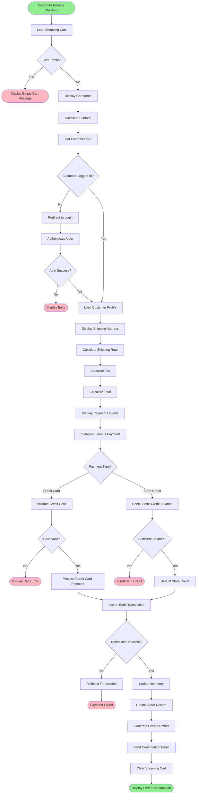
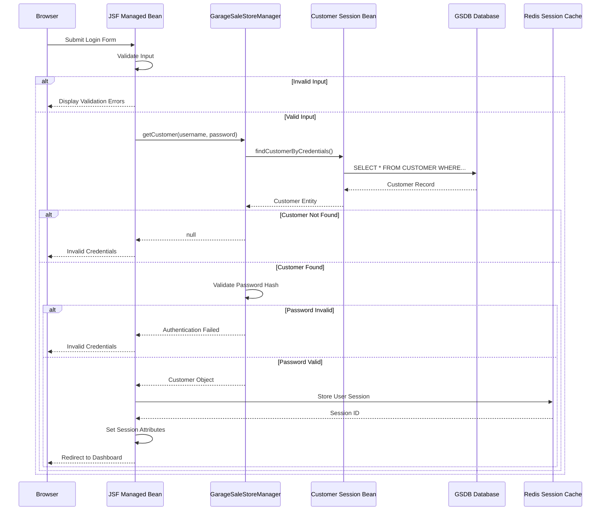
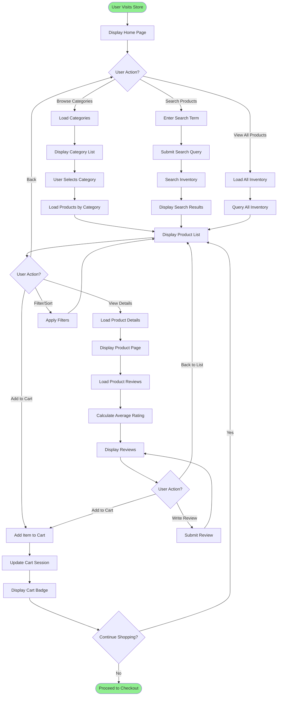
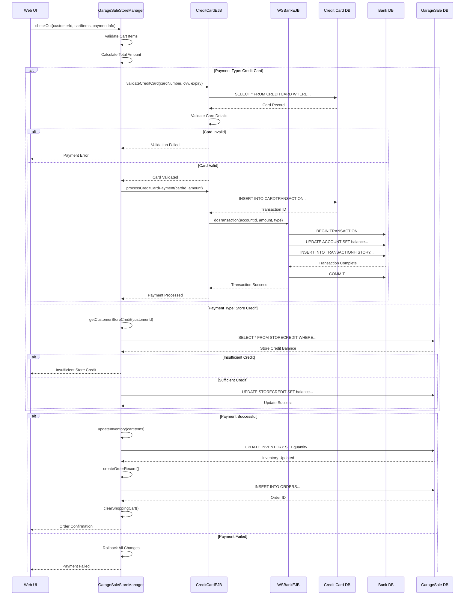
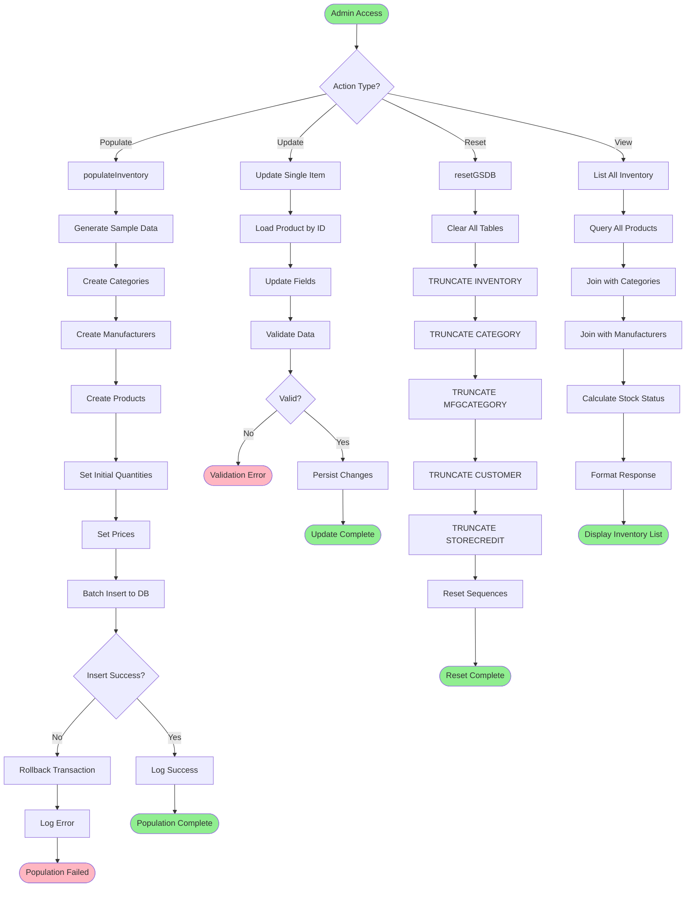
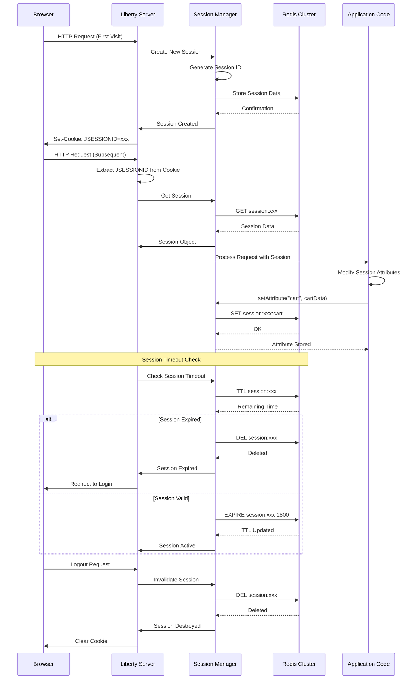
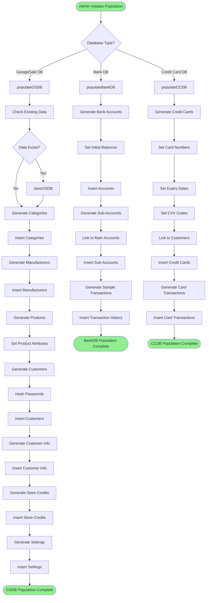
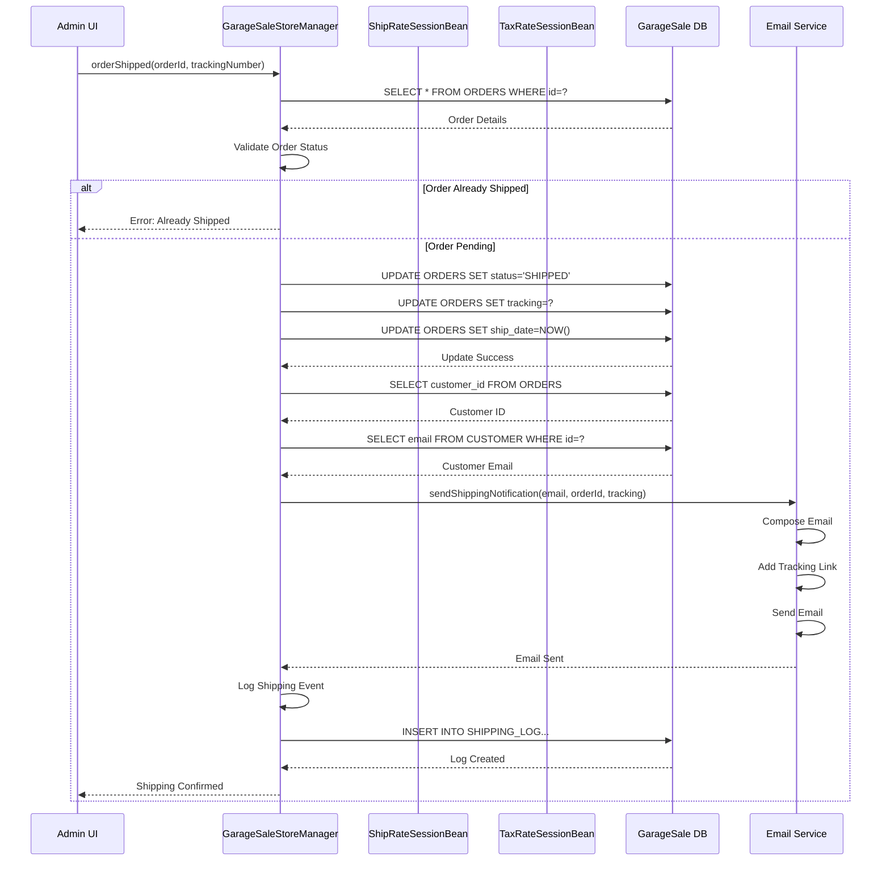
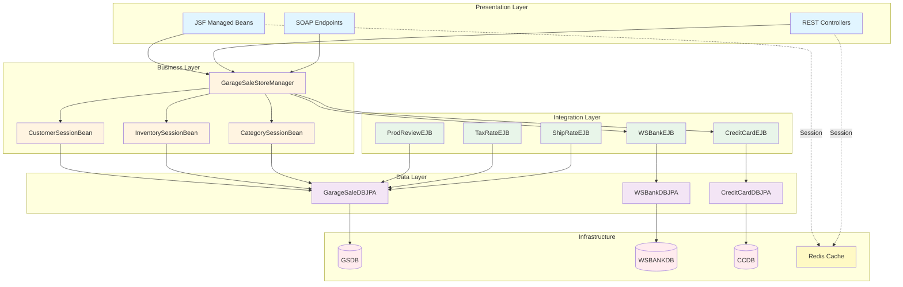

# Application Flowcharts and Sequence Diagrams

## Table of Contents

1. [Customer Checkout Process](#customer-checkout-process)
2. [User Authentication Flow](#user-authentication-flow)
3. [Product Browsing Flow](#product-browsing-flow)
4. [Payment Processing Flow](#payment-processing-flow)
5. [Inventory Management Flow](#inventory-management-flow)
6. [Session Management Flow](#session-management-flow)
7. [Database Population Flow](#database-population-flow)
8. [Order Shipping Flow](#order-shipping-flow)

## Customer Checkout Process

This flowchart illustrates the complete checkout process from cart review to order confirmation.

### Checkout Process Steps

1. **Cart Validation**: Verify cart has items
2. **Authentication**: Ensure customer is logged in
3. **Address Verification**: Confirm shipping address
4. **Cost Calculation**: Calculate shipping, tax, and total
5. **Payment Processing**: Process credit card or store credit
6. **Transaction Recording**: Create bank transaction record
7. **Inventory Update**: Reduce inventory quantities
8. **Order Creation**: Generate order record
9. **Confirmation**: Send email and display confirmation

## User Authentication Flow

## Product Browsing Flow

## Payment Processing Flow

## Inventory Management Flow

## Session Management Flow

## Database Population Flow

## Order Shipping Flow

## Component Interaction Diagram

## Key Process Metrics

### Checkout Process
- **Average Duration**: 15-30 seconds
- **Success Rate**: 95%+
- **Critical Path**: Payment Processing → Inventory Update → Order Creation

### Authentication
- **Average Duration**: 1-2 seconds
- **Cache Hit Rate**: 85%+
- **Session Timeout**: 30 minutes

### Product Browsing
- **Average Page Load**: 500ms - 1s
- **Cache Hit Rate**: 90%+
- **Concurrent Users**: 1000+

### Payment Processing
- **Average Duration**: 3-5 seconds
- **Transaction Success Rate**: 98%+
- **Rollback Rate**: <2%

---

**Next**: [API Documentation](API-Documentation.md) | [Troubleshooting Guide](Troubleshooting-Guide.md)